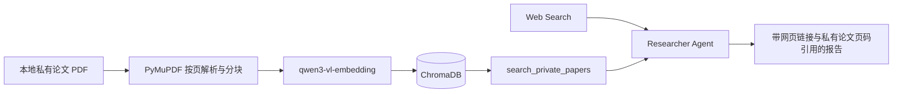

# Deep Research Agent

Deep Research Agent 是一个面向自动化深度研究的智能体项目。它围绕“澄清问题、制定研究计划、检索资料、压缩笔记、生成报告”这条主流程组织，适合用于行业研究、学术资料整理、竞品分析、技术调研和长报告生成。

## 项目内容

- `README.md`：项目入口文档。
- `.env.example`：环境变量模板。

当前项目结构：

```text
DeepResearchAgent/
  README.md
  .env.example
  pyproject.toml
  langgraph.json
  src/
    deep_research_agent/
      configuration.py
      deep_researcher.py
      knowledge/
      server.py
  docs/
    evaluations/
    plans/
    specs/
  tests/
  web/
```

## 快速开始

进入项目目录并创建虚拟环境：

```bash
cd DeepResearchAgent
uv venv
source .venv/bin/activate
```

安装依赖：

```bash
uv sync
```

创建本地环境变量文件：

```bash
cp .env.example .env
```

根据实际使用的模型和搜索工具，在 `.env` 中填写对应密钥。

## 本地运行

启动 LangGraph 本地服务：

```bash
uvx --refresh --from "langgraph-cli[inmem]" --with-editable . --python 3.11 langgraph dev --allow-blocking
```

启动后通常会得到这些入口：

```text
API: http://127.0.0.1:2024
Studio UI: https://smith.langchain.com/studio/?baseUrl=http://127.0.0.1:2024
API Docs: http://127.0.0.1:2024/docs
```

在 LangGraph Studio 的 `messages` 输入框里提交问题，即可观察智能体的研究流程。

## Web UI

启动 FastAPI 后端：

```bash
uv run uvicorn deep_research_agent.server:app --reload --port 8000
```

启动前端：

```bash
cd web
npm install
npm run dev
```

浏览器打开：

```text
http://127.0.0.1:5173
```

Web UI 用于展示一次研究任务的实时进度，包括问题澄清、计划生成、资料检索、笔记压缩和最终报告生成。

## 私有论文混合研究

系统支持上传合法持有的文本型 PDF，并让 Researcher 联合私有论文知识库与 Web Search 开展调研。它不是独立的 PDF Chat：私有论文检索作为 `search_private_papers` 工具接入现有 Supervisor-Researcher 流程。



核心能力：

- PDF 按页解析、稳定 chunk ID、重复文档检测
- 阿里云百炼 `qwen3-vl-embedding` 默认维度向量
- ChromaDB 本地持久化与 Top-K 检索
- Agent 自主选择私有论文、Web Search 或联合检索
- `[Private Paper: 文件名, Page 页码, Chunk ID]` 可追溯引用
- Recall@K 与 Hit Rate@K 检索评测 CLI

启动 FastAPI 与 Web UI 后，在侧栏“私有论文库”上传 PDF，再提交需要联合私有与公开证据的研究课题。

数据边界：PDF 文件与 Chroma 数据保存在本地；解析后的论文 chunks 和检索 query 会发送至阿里云百炼生成向量，不会发送至 Web Search 服务。MVP 不支持扫描件 OCR、复杂表格解析或受限数据库抓取。

## 配置说明

核心配置通常包括四类模型：

- `summarization_model`：总结搜索结果。
- `research_model`：驱动研究智能体。
- `compression_model`：压缩研究笔记。
- `final_report_model`：生成最终报告。

模型需要支持结构化输出和工具调用。搜索工具可按需要接入 Tavily、模型原生搜索、自定义 MCP 工具或其他检索服务。

`.env.example` 中预留了常见变量：

- `OPENAI_API_KEY`
- `DEEPSEEK_API_KEY`
- `ANTHROPIC_API_KEY`
- `GOOGLE_API_KEY`
- `TAVILY_API_KEY`
- `DASHSCOPE_API_KEY`（也兼容现有 `QWEN_API_KEY`）
- `LANGSMITH_API_KEY`
- `LANGSMITH_PROJECT`
- `LANGSMITH_TRACING`

## 评测

项目可对接 Deep Research Bench 做报告质量评测。运行完整评测前请注意成本，100 条任务会消耗较多模型调用额度。

启动评测：

```bash
python tests/run_evaluate.py
```

指定模型：

```bash
python tests/run_evaluate.py --research-model deepseek:deepseek-v4-flash --summarization-model minimax:MiniMax-M2.7
python tests/run_evaluate.py --model qwen:qwen-plus
```

跑指定样本：

```bash
python tests/run_evaluate.py --example-indexes 1,12-17 --max-concurrency 2 --experiment-prefix "DRA Mixed Models Retry"
```

导出 LangSmith 结果：

```bash
python tests/extract_langsmith_data.py --project-name "YOUR_EXPERIMENT_NAME" --model-name "YOUR_MODEL_NAME" --dataset-name "deep_research_bench"
```

### 私有论文检索评测

先固定 chunking 策略并人工标注至少 15 个检索问题的 gold chunks。示例格式见 `tests/fixtures/retrieval_eval.example.jsonl`。

```bash
uv run python tests/evaluate_private_retrieval.py path/to/retrieval_eval.jsonl \
  --output docs/evaluations/private-retrieval.md
```

CLI 会验证 gold chunk 是否仍存在，并报告 Recall@1、Recall@3、Recall@5 与 Hit Rate@K。Web-only 模式没有私有论文候选集，因此只应与 Hybrid 模式比较最终报告的私有证据覆盖率、引用正确率和完整性。
