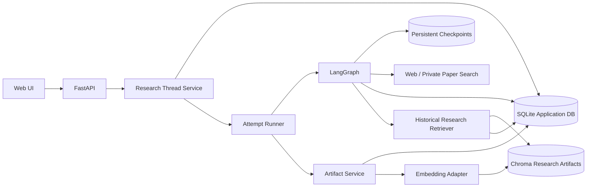

# Spec: Persistent Research History, Follow-ups, and Reuse

## Status

- Phase: Specify
- State: MVP implemented; production hardening and semantic indexing deferred
- Scope: Local single-workspace MVP
- Related requirements:
  1. 历史研究任务持久化与恢复
  2. 完成报告后的连续追问
  3. 历史研究成果复用

## Assumptions To Confirm

1. MVP 延续当前单用户本地应用定位，不在本阶段实现账号、登录和多租户权限系统。
2. 所有持久化数据仍必须带 `workspace_id`，MVP 固定为 `local-ui`，为未来的数据隔离保留边界。
3. SQLite 是任务、消息、事件和报告的事实来源；ChromaDB 只负责历史研究成果的语义检索，不作为事实来源。
4. LangGraph 使用持久化 checkpointer 保存节点级执行状态；应用数据库仍单独保存面向用户的业务状态。
5. 服务重启后，已完成、待澄清和失败任务可以直接恢复展示；崩溃时正在运行的任务标记为 `interrupted`，由用户明确触发继续执行。
6. 从 checkpoint 恢复只能保证外部模型和搜索调用“至少执行一次”。崩溃发生在外部调用完成但 checkpoint 尚未提交时，该调用可能重复并产生额外费用。
7. 完成报告后的追问默认使用 `auto` 模式，由系统判断直接基于历史回答，还是启动补充研究；用户可以显式要求进行补充研究。
8. 历史研究成果属于可复用的研究线索，而不是永远正确的事实。时效性结论在新报告中使用前必须重新验证。

## Objective

将当前一次性、进程内的研究运行升级为可长期存在的研究工作空间，使用户能够：

- 在服务重启后查看并恢复历史研究任务；
- 对已经完成的报告继续追问、扩展或重新研究；
- 在新任务中自动检索并复用过去相关的报告和结论；
- 清楚识别复用了哪次历史研究，以及历史结论的生成时间和来源。

### Target User

持续围绕同一主题开展多轮调研的用户，例如：

- 对一份行业报告连续追加竞争对手、地区或时间范围；
- 服务重启后继续一个尚未完成的长时间研究任务；
- 发起新课题时复用过去已经验证过的结论、来源和研究范围；
- 查询“我们之前对这个主题得出了什么结论”。

### Primary User Stories

1. 作为用户，我希望服务重启后仍能看到历史任务、对话、进度和报告，并继续中断的任务。
2. 作为用户，我希望在报告完成后继续提问，而不必重新描述整份报告的上下文。
3. 作为用户，我希望系统在新研究中找到相关历史成果，避免重复研究，同时对可能过期的结论重新验证。

## Terminology And Ownership

当前实现中的 `RunRecord` 同时承担长期对话与一次执行过程，不适合持久化、恢复和连续追问。新设计拆分为以下概念：

| Concept | Ownership | Description |
|---|---|---|
| `ResearchThread` | Application DB | 用户可见的长期研究会话，包含标题、消息、报告版本和当前状态 |
| `RunAttempt` | Application DB + LangGraph checkpoint | 一次图执行，可由初始问题、澄清回答、完成后追问或恢复操作触发 |
| `ResearchMessage` | Application DB | 长期保存的用户和助手消息 |
| `ResearchEvent` | Application DB | 一次执行产生的持久化进度事件 |
| `ResearchArtifact` | Application DB | 可复用的报告、报告摘要或研究成果 |
| `ArtifactIndexEntry` | ChromaDB | 指向 `ResearchArtifact` 的语义检索条目 |
| `Checkpoint` | LangGraph checkpointer | 用于恢复图节点状态的内部执行数据，不直接作为 API 响应 |

原则：

- `ResearchThread` 是用户体验中的“研究任务”。
- `RunAttempt` 是内部执行和审计单位。
- SQLite 中的消息、事件、报告和状态是业务事实。
- Checkpoint 用于恢复执行，但不替代业务数据。
- ChromaDB 中的索引可随时重建，不保存唯一副本。

## Proposed Architecture



### Storage Responsibilities

建议使用两个独立 SQLite 文件，降低业务事务与 checkpoint 高频写入之间的锁竞争：

```text
.knowledge/research.sqlite       # threads, attempts, messages, events, artifacts
.knowledge/checkpoints.sqlite    # LangGraph persistent checkpoints
.knowledge/research_artifacts/   # Chroma research-artifact collection
```

建议新增依赖：

- `aiosqlite`: 异步访问应用 SQLite。
- `langgraph-checkpoint-sqlite`: LangGraph SQLite checkpointer。

实现开始前应确认当前 LangGraph 版本对应的 checkpointer 初始化和恢复 API。

## Data Model

### `research_threads`

| Field | Type | Notes |
|---|---|---|
| `id` | TEXT PK | 延续现有 `/api/runs/{id}` 中的 ID |
| `workspace_id` | TEXT | MVP 固定为 `local-ui` |
| `title` | TEXT | 默认从首次问题生成，可后续编辑 |
| `status` | TEXT | 见状态机 |
| `language` | TEXT | 当前会话语言 |
| `config_json` | TEXT | 过滤敏感字段后的运行配置 |
| `latest_report_id` | TEXT nullable | 最新报告版本 |
| `current_attempt_id` | TEXT nullable | 当前执行尝试 |
| `version` | INTEGER | 乐观并发控制 |
| `created_at` | TEXT | UTC ISO timestamp |
| `updated_at` | TEXT | UTC ISO timestamp |

不得持久化 API key、Authorization header、Cookie 或其他凭据。配置写入前必须经过白名单过滤。

### `run_attempts`

| Field | Type | Notes |
|---|---|---|
| `id` | TEXT PK | 一次执行尝试的 ID |
| `thread_id` | TEXT FK | 所属长期研究会话 |
| `trigger` | TEXT | `initial`, `clarification`, `follow_up`, `resume`, `retry` |
| `mode` | TEXT | `deep_research`, `follow_up_answer` |
| `status` | TEXT | `queued`, `running`, `interrupted`, `completed`, `failed`, `cancelled` |
| `checkpoint_thread_id` | TEXT | LangGraph checkpoint namespace |
| `resume_count` | INTEGER | 恢复次数 |
| `error_code` | TEXT nullable | 稳定机器错误码 |
| `error_message` | TEXT nullable | 用户可理解错误 |
| `started_at` | TEXT nullable | UTC timestamp |
| `finished_at` | TEXT nullable | UTC timestamp |
| `created_at` | TEXT | UTC timestamp |

### `research_messages`

| Field | Type | Notes |
|---|---|---|
| `id` | TEXT PK | 消息 ID |
| `thread_id` | TEXT FK | 所属会话 |
| `attempt_id` | TEXT FK nullable | 产生或消费该消息的执行尝试 |
| `role` | TEXT | `human`, `ai`, `system` |
| `message_type` | TEXT | LangChain 消息类型 |
| `content_json` | TEXT | 保留结构化消息内容 |
| `sequence` | INTEGER | 会话内严格递增 |
| `created_at` | TEXT | UTC timestamp |

仅保存业务可见消息。模型内部 prompt、工具原始响应和思考内容不得混入长期对话记录。

### `research_events`

| Field | Type | Notes |
|---|---|---|
| `id` | TEXT PK | 延续现有 event ID |
| `thread_id` | TEXT FK | 所属会话 |
| `attempt_id` | TEXT FK | 所属执行尝试 |
| `sequence` | INTEGER | attempt 内严格递增 |
| `type` | TEXT | 现有事件类型 |
| `title` | TEXT nullable | 用户可见标题 |
| `message` | TEXT nullable | 用户可见说明 |
| `data_json` | TEXT | 事件数据 |
| `created_at` | TEXT | UTC timestamp |

### `research_artifacts`

| Field | Type | Notes |
|---|---|---|
| `id` | TEXT PK | Artifact ID |
| `workspace_id` | TEXT | 检索隔离边界 |
| `thread_id` | TEXT FK | 来源会话 |
| `attempt_id` | TEXT FK | 来源执行尝试 |
| `artifact_type` | TEXT | `report`, `report_summary`, `follow_up_answer` |
| `version` | INTEGER | 同一 thread 内的报告版本 |
| `title` | TEXT | 检索和展示标题 |
| `content` | TEXT | 完整内容或结构化摘要 |
| `as_of_date` | TEXT | 结论对应日期 |
| `source_refs_json` | TEXT | 原始网页、私有论文和历史报告引用 |
| `index_status` | TEXT | `pending`, `indexed`, `failed` |
| `created_at` | TEXT | UTC timestamp |

## State And Recovery Semantics

### Research Thread Status

```text
queued
  -> running
  -> requires_clarification
  -> completed
  -> failed
  -> cancelled
  -> interrupted
```

状态规则：

- `requires_clarification` 和 `completed` 均允许用户继续发送消息。
- `completed` 后收到新消息时，保留已有报告，将 thread 状态转为 `queued`，创建新的 `RunAttempt`。
- 新尝试完成后生成新的消息或报告版本，不覆盖旧报告。
- 同一 thread 同一时间最多存在一个 `queued` 或 `running` attempt。
- 使用 `thread.version` 或数据库条件更新防止重复提交和并发覆盖。

### Persistence Rules

关键状态变化采用应用数据库事务：

1. 接收用户消息时，在同一事务中写入消息、创建 attempt、更新 thread 状态。
2. attempt 启动前先持久化 `running` 状态。
3. 事件先写入数据库，再发布至进程内 SSE 队列。
4. 报告生成后，在同一事务中写入 artifact、助手消息并更新 thread。
5. Chroma 索引在业务事务提交后执行；索引失败不影响已完成报告。

### Startup Reconciliation

应用启动时执行恢复扫描：

- `completed`, `failed`, `cancelled`, `requires_clarification`：保持原状态。
- `queued`：保留为可执行状态，可由后台调度器启动。
- `running` 且无当前进程执行租约：标记为 `interrupted`。
- `interrupted` 且存在 checkpoint：UI 提供“继续恢复”操作。
- `interrupted` 且无 checkpoint：UI 提供“重新执行”操作，并明确可能重复研究。

MVP 不自动恢复崩溃中的昂贵研究调用，避免在无人确认时重复产生模型和搜索费用。

### Checkpoint Integration

- 将 `deep_researcher_builder` 暴露为构建入口，在 FastAPI lifespan 中注入持久化 checkpointer 后编译运行时图。
- 测试继续允许注入 `MemorySaver` 或 fake checkpointer。
- 每个 `RunAttempt` 使用稳定的 `checkpoint_thread_id`。
- 同一次 interrupted attempt 恢复时复用原 `checkpoint_thread_id`。
- 新的追问 attempt 使用新的 `checkpoint_thread_id`，长期对话上下文由应用数据库显式装载，避免 checkpoint 状态无限增长。

### Idempotency Boundary

数据库写入、事件和 artifact 创建必须使用稳定 ID 或唯一约束实现幂等。外部模型、Embedding 和搜索服务无法保证 exactly-once：

- 恢复后可能重复一次尚未 checkpoint 的外部调用。
- 工具调用和报告 artifact 应使用 attempt ID 与逻辑步骤 ID 去重。
- UI 必须提示恢复可能产生额外调用费用。

## Functional Requirements

### FR-1: Persistent Research Threads

- 创建研究任务时立即持久化 thread、首条用户消息和 initial attempt。
- 服务重启后，历史任务列表、完整消息、事件和报告仍可读取。
- 提供分页历史列表，默认按 `updated_at` 倒序。
- 读取任务时不依赖进程内 `runs` 字典。
- 进程内对象只保存执行 task、SSE subscriber 和短期锁。

### FR-2: Recover Interrupted Attempts

- 服务启动时识别没有活跃执行器的 `running` attempt，并标记为 `interrupted`。
- 用户可从最近 checkpoint 继续 interrupted attempt。
- 若 checkpoint 不存在或损坏，返回明确错误并允许创建 retry attempt。
- 恢复、重试和原 attempt 的关系必须可审计。
- 待澄清任务无需 checkpoint 即可继续，因为消息和状态已持久化。

### FR-3: Continue After Completed Report

`POST /api/runs/{run_id}/messages` 从“仅允许回答澄清”扩展为通用会话消息接口。

请求支持：

```json
{
  "message": "请把第三部分与最新公开数据结合后展开。",
  "mode": "auto",
  "idempotency_key": "client-generated-key"
}
```

`mode` 语义：

| Mode | Behavior |
|---|---|
| `auto` | 判断直接回答还是执行补充研究 |
| `answer` | 仅根据当前 thread 历史、报告和已保存来源回答，不执行新的 Web Search |
| `research` | 启动新的深度研究 attempt，并生成新报告版本 |

`auto` 路由建议：

- 解释、摘要、改写、定位报告内容：`follow_up_answer`。
- 请求最新数据、扩大范围、加入新对象、验证或修正结论：`deep_research`。
- 判断不确定时采用 `deep_research`，并在 UI 中展示将进行补充研究。

连续追问必须：

- 装载当前 thread 的相关消息和最新报告摘要；
- 保留旧报告，不把 follow-up 结果静默覆盖为唯一版本；
- 在需要新研究时将原报告作为背景，而不是未经验证地视为新事实；
- 允许同一 thread 多次追问。

### FR-4: Create Reusable Research Artifacts

每次成功生成报告后，异步创建：

1. 完整 `report` artifact；
2. 用于语义检索的结构化 `report_summary` artifact；
3. 基于稳定 chunking 生成的报告索引条目。

建议的摘要内容：

```json
{
  "topic": "研究主题",
  "scope": "研究范围与限制",
  "key_findings": ["结论一", "结论二"],
  "caveats": ["时效性或证据限制"],
  "source_refs": ["原始来源引用"],
  "as_of_date": "2026-06-14"
}
```

摘要生成或索引失败不得将已完成 thread 改为失败；应保存 `index_status=failed` 并支持重试。

### FR-5: Retrieve Historical Research

新增历史成果检索服务，处理流程：

1. 使用当前问题生成 query embedding。
2. 在 Chroma `research_artifacts` collection 中按 `workspace_id` 过滤。
3. 默认排除当前 thread，连续追问场景可显式包含当前 thread。
4. 检索摘要和报告 chunks，按相关度阈值与 Top-K 限制结果。
5. 从 SQLite 根据 artifact ID 装载可信业务数据。
6. 将历史成果以带来源和日期的上下文注入 Agent。

建议返回格式：

```text
[Historical Research: <title>, Date <as_of_date>, Report <artifact_id>]
Scope: ...
Relevant findings: ...
Original sources: ...
```

历史成果注入位置：

- `clarify_with_user`：帮助判断用户是否已经提供足够上下文；
- `write_research_brief`：复用过去的范围、结论和未解决问题；
- follow-up router/answerer：理解完成报告后的追问；
- Researcher：将历史结果作为研究线索，并在需要时验证。

### FR-6: Freshness And Provenance

- 每条历史成果必须包含 `as_of_date`、来源 thread 和 artifact ID。
- Prompt 必须声明历史成果是不受信任且可能过期的研究上下文。
- 涉及“最新、当前、价格、政策、版本、人员”等时效性事实时，深度研究模式必须重新搜索验证。
- 最终报告引用历史成果时，应保留 `[Historical Research: ...]` 标识，并尽可能引用其原始来源。
- 不得把历史报告中的模型推断伪装成已验证事实。

### FR-7: History And Report UI

- 左侧会话列表从持久化 API 加载历史 thread。
- 点击历史 thread 后恢复消息、事件和最新报告。
- `interrupted` thread 显示“继续恢复”和“重新执行”操作。
- 已完成报告下方显示追问输入框，并允许选择 `auto` 或“补充研究”。
- 有多个报告版本时允许查看版本列表和生成时间。
- 展示本次研究复用了哪些历史报告。

## Proposed Interfaces

为降低前端迁移成本，MVP 保留 `/api/runs` 路径，但其资源语义升级为长期 `ResearchThread`。

### Research Thread API

```text
POST   /api/runs
GET    /api/runs?pageSize=20&cursor=<cursor>&status=<status>
GET    /api/runs/{run_id}
POST   /api/runs/{run_id}/messages
POST   /api/runs/{run_id}/resume
POST   /api/runs/{run_id}/retry
POST   /api/runs/{run_id}/cancel
GET    /api/runs/{run_id}/events
GET    /api/runs/{run_id}/reports
GET    /api/runs/{run_id}/reports/{report_id}
```

`GET /api/runs` 响应：

```json
{
  "data": [
    {
      "id": "thread-id",
      "title": "研究主题",
      "status": "completed",
      "latest_report_id": "report-id",
      "created_at": "2026-06-14T08:00:00Z",
      "updated_at": "2026-06-14T09:00:00Z"
    }
  ],
  "next_cursor": null
}
```

### Event Stream Recovery

`GET /api/runs/{run_id}/events` 支持 `Last-Event-ID` 或 `afterEventId`：

- 首次连接回放当前 attempt 已持久化事件；
- 断线重连只发送指定事件之后的内容；
- 终态 thread 回放完成后关闭连接；
- 事件 ID 和 sequence 必须稳定，客户端继续按 ID 去重。

### Historical Research Internal Interface

MVP 不要求直接向用户暴露全局记忆搜索 API。内部接口建议：

```python
class HistoricalResearchRetriever:
    async def search(
        self,
        workspace_id: str,
        query: str,
        top_k: int,
        exclude_thread_id: str | None = None,
    ) -> list[HistoricalResearchResult]:
        ...
```

## Error Semantics

所有新增 API 错误使用稳定结构：

```json
{
  "error": {
    "code": "RUN_ALREADY_ACTIVE",
    "message": "This research task already has an active attempt.",
    "details": {}
  }
}
```

建议错误码：

| HTTP | Code | Scenario |
|---|---|---|
| `404` | `RUN_NOT_FOUND` | thread 不存在 |
| `409` | `RUN_ALREADY_ACTIVE` | 同一 thread 已有活跃 attempt |
| `409` | `RUN_NOT_RESUMABLE` | 非 interrupted 状态或无 checkpoint |
| `409` | `VERSION_CONFLICT` | 并发更新冲突 |
| `422` | `INVALID_MESSAGE_MODE` | 不支持的 follow-up mode |
| `500` | `PERSISTENCE_ERROR` | 数据库写入失败 |
| `503` | `CHECKPOINT_UNAVAILABLE` | checkpoint store 不可用 |

## Module Boundaries

建议新增模块：

```text
src/deep_research_agent/
  persistence/
    database.py            # SQLite lifecycle, migrations, transactions
    models.py              # Persistent business data contracts
    repositories.py        # Thread, attempt, message, event, artifact repositories
  research_history/
    service.py             # Thread lifecycle and follow-up orchestration
    artifacts.py           # Artifact extraction and indexing
    retrieval.py           # Historical research retrieval
    store.py               # Chroma research-artifact index
  graphs/
    follow_up.py           # Follow-up routing and direct-answer graph
  server.py                # HTTP/SSE wiring only
```

现有模块调整：

- `deep_researcher.py`：暴露可注入 checkpointer 的 graph builder；接收历史研究上下文。
- `state.py`：增加历史上下文或 follow-up 所需状态，但不直接依赖数据库类型。
- `configuration.py`：增加数据库、checkpoint、历史检索和索引配置。
- `server.py`：移除 `runs` 作为事实来源，只保留活跃 task 和 subscriber registry。

## Configuration

建议新增配置：

| Field | Default | Description |
|---|---|---|
| `research_database_path` | `.knowledge/research.sqlite` | 应用业务数据库 |
| `checkpoint_database_path` | `.knowledge/checkpoints.sqlite` | LangGraph checkpoint 数据库 |
| `research_history_path` | `.knowledge/research_artifacts` | 历史成果 Chroma 路径 |
| `research_history_enabled` | `true` | 是否复用历史成果 |
| `research_history_top_k` | `5` | 默认检索结果数 |
| `research_history_min_score` | implementation-tuned | 最低相关度阈值 |
| `research_history_chunk_size` | `1600` | 报告索引 chunk 大小 |
| `research_history_chunk_overlap` | `200` | 报告索引 overlap |
| `workspace_id` | `local-ui` | MVP 数据隔离命名空间 |

## Security And Data Boundaries

- 数据库、checkpoint 和 Chroma 路径必须加入 `.gitignore`。
- API key 和敏感 header 不得进入数据库、checkpoint、事件或日志。
- 历史成果检索必须始终按 `workspace_id` 过滤，即使 MVP 只有一个 workspace。
- 从历史报告检索出的文本视为不受信任输入，防止其中的指令覆盖系统 prompt。
- 用户可见事件不得保存模型思考内容或隐藏 prompt。
- 本阶段不实现历史任务删除；在进入多用户或生产环境前，必须增加删除、导出和保留策略。

## Migration And Compatibility

当前 `runs` 数据仅存在内存中，无法在部署升级时迁移。实施后的兼容策略：

1. 保留已有 `POST /api/runs`、`GET /api/runs/{id}`、消息、取消和事件路径。
2. 对现有 snapshot 响应只增加字段，不删除或重命名字段。
3. `POST /api/runs/{id}/messages` 继续支持原 `{ "message": "..." }` 请求；缺省 `mode` 为 `auto`。
4. 前端逐步从单个当前 run 状态迁移到历史 thread 列表。
5. 数据库 schema 使用显式版本和迁移脚本，不在启动时静默执行破坏性重建。

## Implementation Plan

### Phase 1: Persistent Business History

1. 建立 SQLite lifecycle、schema migration 和 repository 层。
2. 将 thread、attempt、message、event 和 report artifact 写入 SQLite。
3. 用持久化 repository 替换 `runs` 字典作为事实来源。
4. 增加历史列表、报告版本和可恢复 SSE 回放 API。
5. 前端增加历史任务列表与历史任务恢复展示。

验证检查点：

- 服务重启后，已完成和待澄清任务内容完全可读。
- 事件断线重连不会丢失或重复展示。
- 并发创建消息不会生成两个活跃 attempt。

### Phase 2: Durable Execution Recovery

1. 将主图改为 graph builder，并在应用 lifespan 中注入持久化 checkpointer。
2. 建立 attempt execution registry、启动恢复扫描和 `interrupted` 状态。
3. 增加 resume/retry API 和 UI。
4. 为业务写入、事件和 artifact 增加幂等约束。

验证检查点：

- 在研究节点间终止服务，重启后任务显示为 interrupted。
- 从 checkpoint 恢复后能够完成研究。
- 无 checkpoint 时明确降级为 retry，不伪装为恢复。

### Phase 3: Completed-Report Follow-ups

1. 将消息接口扩展为通用 follow-up 接口。
2. 增加 `auto`, `answer`, `research` 模式与 follow-up router。
3. 为 direct answer 建立轻量 follow-up graph。
4. 在补充研究中注入当前 thread 的最新报告摘要和相关消息。
5. 增加报告版本管理与 UI 版本切换。

验证检查点：

- 完成报告后可连续进行至少三轮追问。
- 摘要类追问不触发 Web Search。
- 明确要求最新数据的追问触发补充研究并生成新报告版本。

### Phase 4: Historical Research Reuse

1. 定义 artifact 摘要 schema 和报告稳定 chunking。
2. 完成报告后异步生成摘要、embedding 和 Chroma 索引。
3. 实现按 workspace 过滤的历史成果检索。
4. 将历史上下文接入澄清、research brief、follow-up 和 Researcher。
5. 增加来源、时效性提示和索引失败重试。

验证检查点：

- 新任务能够召回相关旧报告，并显示复用来源。
- 不相关历史报告不会注入 Agent。
- 时效性问题会重新验证，而不是直接复述旧结论。

## Testing Strategy

### Unit Tests

- Repository CRUD、事务回滚、唯一约束和配置敏感字段过滤。
- 状态迁移和同一 thread 单活跃 attempt 约束。
- 消息序列、事件序列和 event replay cursor。
- follow-up router 对摘要、扩展范围和最新数据问题的路由。
- artifact 摘要解析、稳定 chunk ID 和索引失败状态。
- 历史检索 workspace 过滤、当前 thread 排除、Top-K 和阈值。

### Integration Tests

- 创建任务、完成报告、重启应用对象后读取完整历史。
- 待澄清任务重启后提交回答并继续。
- 模拟 checkpoint 后中断，恢复 attempt 并完成。
- 完成报告后 direct answer 和 deep research 两种追问闭环。
- 完成报告、建立索引、新任务召回旧报告的完整复用链路。
- SSE 使用 `Last-Event-ID` 重连并只回放缺失事件。

外部模型、Embedding、Web Search 和 Chroma 行为在自动化测试中使用 fake 或临时目录，避免真实费用和网络依赖。

### Recovery Fault Injection

至少在以下位置模拟进程终止：

- thread 和 attempt 已创建，但 graph 尚未启动；
- graph 已 checkpoint，但状态尚未完成；
- 最终报告已生成，但 artifact 索引尚未完成；
- artifact 已保存，但 Chroma 索引写入失败。

### Evaluation

历史成果复用至少准备 15 个测试问题：

- 5 个应召回明确相关旧报告的问题；
- 5 个不应召回任何历史报告的问题；
- 5 个相关但结论可能过期、必须重新验证的问题。

记录：

- Artifact Recall@K；
- 不相关历史注入率；
- 过期结论未经验证使用率；
- 使用历史成果后减少的重复搜索调用数；
- follow-up 路由准确率。

## Commands

```bash
# Install dependencies
uv sync

# Run backend
uv run uvicorn deep_research_agent.server:app --reload --port 8000

# Run Python tests
uv run pytest

# Run Python lint
uv run ruff check src tests

# Build frontend
cd web && npm run build
```

## Boundaries

### Always Do

- 先写业务数据库，再向 SSE 客户端发布状态和事件。
- 保留历史报告版本，不静默覆盖用户已经看到的报告。
- 对历史成果保留来源、生成日期和原始引用。
- 对数据库迁移、恢复路径和索引失败做自动化测试。
- 将 workspace 过滤作为所有历史检索的强制条件。

### Ask First

- 将 SQLite 替换为 PostgreSQL 或增加外部队列。
- 自动恢复所有 interrupted 任务并可能产生额外模型费用。
- 增加用户身份、共享工作区或跨用户成果复用。
- 自动删除、压缩或过期历史数据。
- 将历史研究成果发送给新的第三方服务。

### Never Do

- 将 ChromaDB 或 checkpoint 作为任务、消息和报告的唯一事实来源。
- 将 API key、隐藏 prompt 或模型思考内容持久化。
- 在没有来源和日期的情况下向 Agent 注入历史结论。
- 把旧报告中的时效性结论直接当作当前事实。
- 在恢复失败时静默从头执行并产生不可见的重复费用。

## Success Criteria

- [ ] 服务重启后可读取历史任务列表、消息、事件和所有报告版本。
- [ ] 待澄清任务在重启后可继续提交回答。
- [ ] 运行中任务在崩溃后显示为 `interrupted`，并可从 checkpoint 恢复或明确重试。
- [ ] 同一 thread 不会并发运行两个 attempt。
- [ ] 完成报告后可以连续追问，且旧报告仍可查看。
- [ ] 摘要和解释类追问可直接回答，不触发不必要的深度研究。
- [ ] 扩展范围或最新数据类追问能够启动补充研究并生成新报告版本。
- [ ] 成功报告能够生成可检索 artifact，索引失败不会使报告任务失败。
- [ ] 新研究能够召回相关历史成果，并展示来源报告与生成日期。
- [ ] 历史检索始终按 workspace 隔离，且当前 thread 排除规则符合场景。
- [ ] 时效性历史结论在新报告使用前会重新验证。
- [ ] 自动化测试覆盖重启恢复、checkpoint 恢复、连续追问和历史成果复用闭环。

## Not Doing In MVP

- 用户登录、多租户权限和跨 workspace 分享；
- 自动后台恢复所有 interrupted 任务；
- Exactly-once 外部模型或搜索调用；
- 历史任务删除、导出、保留周期和合规审计；
- 用户偏好记忆、事实级记忆更新和冲突消解；
- 跨报告知识图谱、自动事实合并和结论版本推理；
- 分布式 worker、消息队列和多实例执行协调；
- PostgreSQL、云端向量数据库和生产级高可用。

## Open Questions

无。

## Confirmed Product Decisions

1. 完成报告后的追问默认使用 `auto` 模式。
2. Interrupted 任务必须由用户手动恢复，不自动恢复。
3. 历史成果复用必须由用户为每个新任务显式开启。
4. 报告版本只保存最终报告，不保存中间 research brief 和压缩笔记版本。

## Current MVP Implementation Notes

- 任务、消息、事件和最终报告版本已使用 SQLite 持久化。
- 历史成果复用当前使用本地可重建的轻量文本相关度检索；后续可替换为 Chroma 语义索引。
- LangGraph 已使用 SQLite checkpointer；interrupted 手动恢复优先从最近 checkpoint 继续，没有可用 checkpoint 时退化为基于持久化对话重新执行。
